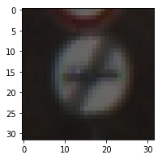
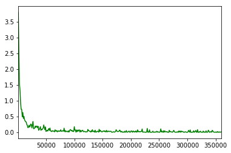
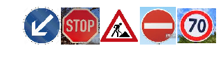

# Self-Driving Car Engineer Nanodegree

## Deep Learning

## Project: Build a Traffic Sign Recognition Classifier

In this notebook, a template is provided for you to implement your functionality in stages, which is required to successfully complete this project. If additional code is required that cannot be included in the notebook, be sure that the Python code is successfully imported and included in your submission if necessary. 

> **Note**: Once you have completed all of the code implementations, you need to finalize your work by exporting the iPython Notebook as an HTML document. Before exporting the notebook to html, all of the code cells need to have been run so that reviewers can see the final implementation and output. You can then export the notebook by using the menu above and navigating to  \n",
    "**File -> Download as -> HTML (.html)**. Include the finished document along with this notebook as your submission. 

In addition to implementing code, there is a writeup to complete. The writeup should be completed in a separate file, which can be either a markdown file or a pdf document. There is a [write up template](https://github.com/udacity/CarND-Traffic-Sign-Classifier-Project/blob/master/writeup_template.md) that can be used to guide the writing process. Completing the code template and writeup template will cover all of the [rubric points](https://review.udacity.com/#!/rubrics/481/view) for this project.

The [rubric](https://review.udacity.com/#!/rubrics/481/view) contains "Stand Out Suggestions" for enhancing the project beyond the minimum requirements. The stand out suggestions are optional. If you decide to pursue the "stand out suggestions", you can include the code in this Ipython notebook and also discuss the results in the writeup file.


>**Note:** Code and Markdown cells can be executed using the **Shift + Enter** keyboard shortcut. In addition, Markdown cells can be edited by typically double-clicking the cell to enter edit mode.

---
## Step 0: Load The Data


```python
# Load pickled data
import pickle

# TODO: Fill this in based on where you saved the training and testing data

training_file = "train.p"
validation_file="valid.p"
testing_file = "test.p"

with open(training_file, mode='rb') as f:
    train = pickle.load(f)
with open(validation_file, mode='rb') as f:
    valid = pickle.load(f)
with open(testing_file, mode='rb') as f:
    test = pickle.load(f)
    
X_train, y_train = train['features'], train['labels']
X_valid, y_valid = valid['features'], valid['labels']
X_test, y_test = test['features'], test['labels']
```

---

## Step 1: Dataset Summary & Exploration

The pickled data is a dictionary with 4 key/value pairs:

- `'features'` is a 4D array containing raw pixel data of the traffic sign images, (num examples, width, height, channels).
- `'labels'` is a 1D array containing the label/class id of the traffic sign. The file `signnames.csv` contains id -> name mappings for each id.
- `'sizes'` is a list containing tuples, (width, height) representing the original width and height the image.
- `'coords'` is a list containing tuples, (x1, y1, x2, y2) representing coordinates of a bounding box around the sign in the image. **THESE COORDINATES ASSUME THE ORIGINAL IMAGE. THE PICKLED DATA CONTAINS RESIZED VERSIONS (32 by 32) OF THESE IMAGES**

Complete the basic data summary below. Use python, numpy and/or pandas methods to calculate the data summary rather than hard coding the results. For example, the [pandas shape method](http://pandas.pydata.org/pandas-docs/stable/generated/pandas.DataFrame.shape.html) might be useful for calculating some of the summary results. 

### I used the Python library to calculate summary statistics of the traffic signs data set:

- The size of training set is **34799**

- The size of the validation set is **4410**

- The size of test set is **12630**

- The shape of a traffic sign image is:
	**Width:32, Height:32, Channels:3**

- The number of unique classes/labels in the data set is **43**

### Provide a Basic Summary of the Data Set Using Python, Numpy and/or Pandas


```python
### Replace each question mark with the appropriate value. 
### Use python, pandas or numpy methods rather than hard coding the results
import numpy as np

# TODO: Number of training examples
n_train = len(X_train)

# TODO: Number of validation examples
n_validation = len(X_valid)

# TODO: Number of testing examples.
n_test = len(X_test)

# TODO: What's the shape of an traffic sign image?
image_shape = X_train[0].shape

# TODO: How many unique classes/labels there are in the dataset.
n_classes = len(np.unique(y_train))

print("Number of training examples =", n_train)
print("Number of validation examples =", n_validation)
print("Number of testing examples =", n_test)
print("Image data shape =", image_shape)
print("Number of classes =", n_classes)
```

    Number of training examples = 34799
    Number of validation examples = 4410
    Number of testing examples = 12630
    Image data shape = (32, 32, 3)
    Number of classes = 43
    

### Include an exploratory visualization of the dataset

Visualize the German Traffic Signs Dataset using the pickled file(s). This is open ended, suggestions include: plotting traffic sign images, plotting the count of each sign, etc. 

The [Matplotlib](http://matplotlib.org/) [examples](http://matplotlib.org/examples/index.html) and [gallery](http://matplotlib.org/gallery.html) pages are a great resource for doing visualizations in Python.

**NOTE:** It's recommended you start with something simple first. If you wish to do more, come back to it after you've completed the rest of the sections. It can be interesting to look at the distribution of classes in the training, validation and test set. Is the distribution the same? Are there more examples of some classes than others?


```python
### Data exploration visualization code goes here.
### Feel free to use as many code cells as needed.
import matplotlib.pyplot as plt
# Visualizations will be shown in the notebook.
%matplotlib inline

image=X_train[5].squeeze()
plt.figure(figsize=(3,3))
plt.imshow(image,cmap="gray")
#print(y_train[5])
print(X_train[0].shape)
```

    (32, 32, 3)
    





**It is a bar chart showing the frequency distribution of the training data with respect to the number of classes, i.e. how many images are there for each class.**


```python
hist, bins = np.histogram(y_train, bins=n_classes)
width = 0.7 * (bins[1] - bins[0])
center = (bins[:-1] + bins[1:]) / 2
plt.bar(center, hist, align='center', width=width)
plt.show()
```


----

## Step 2: Design and Test a Model Architecture

Design and implement a deep learning model that learns to recognize traffic signs. Train and test your model on the [German Traffic Sign Dataset](http://benchmark.ini.rub.de/?section=gtsrb&subsection=dataset).

The LeNet-5 implementation shown in the [classroom](https://classroom.udacity.com/nanodegrees/nd013/parts/fbf77062-5703-404e-b60c-95b78b2f3f9e/modules/6df7ae49-c61c-4bb2-a23e-6527e69209ec/lessons/601ae704-1035-4287-8b11-e2c2716217ad/concepts/d4aca031-508f-4e0b-b493-e7b706120f81) at the end of the CNN lesson is a solid starting point. You'll have to change the number of classes and possibly the preprocessing, but aside from that it's plug and play! 

With the LeNet-5 solution from the lecture, you should expect a validation set accuracy of about 0.89. To meet specifications, the validation set accuracy will need to be at least 0.93. It is possible to get an even higher accuracy, but 0.93 is the minimum for a successful project submission. 

There are various aspects to consider when thinking about this problem:

- Neural network architecture (is the network over or underfitting?)
- Play around preprocessing techniques (normalization, rgb to grayscale, etc)
- Number of examples per label (some have more than others).
- Generate fake data.

Here is an example of a [published baseline model on this problem](http://yann.lecun.com/exdb/publis/pdf/sermanet-ijcnn-11.pdf). It's not required to be familiar with the approach used in the paper but, it's good practice to try to read papers like these.

### Pre-process the Data Set (normalization, grayscale, etc.)

Minimally, the image data should be normalized so that the data has mean zero and equal variance. For image data, `(pixel - 128)/ 128` is a quick way to approximately normalize the data and can be used in this project. 

Other pre-processing steps are optional. You can try different techniques to see if it improves performance. 

Use the code cell (or multiple code cells, if necessary) to implement the first step of your project.

**- First, I decided to convert the images to grayscale because the color of the meaning of the traffic sign doesn't changes with respect to the color. Ex: A Stop sign will indicate the to stop whether it is in red,blue or black.**
**- The other point is reducing the number of channels will reduce the respective calculations the making the network faster to learn.**


**- Then, I normalized the image data to have the zero mean and equal variance.**


```python
### Preprocess the data here. It is required to normalize the data. Other preprocessing steps could include 
### converting to grayscale, etc.
### Feel free to use as many code cells as needed.
## Converting image to single channel from 3 channels
import numpy as np
from sklearn.utils import shuffle

X_train = np.divide(np.subtract(np.average(X_train,axis=3),128.0),128.0)
X_valid = np.divide(np.subtract(np.average(X_valid,axis=3),128.0),128.0)
X_test = np.divide(np.subtract(np.average(X_test,axis=3),128.0),128.0)
#print(X_test)
X_train=np.reshape(X_train,(X_train.shape[0],X_train.shape[1],X_train.shape[2],1))
X_valid=np.reshape(X_valid,(X_valid.shape[0],X_valid.shape[1],X_valid.shape[2],1))
X_test=np.reshape(X_test,(X_test.shape[0],X_test.shape[1],X_test.shape[2],1))
#print(X_train.shape)
X_train, y_train = shuffle(X_train, y_train)
```

**My final model consisted of the following layers:**

| Layer         		|     Description	        					| 
|:---------------------:|:---------------------------------------------:| 
| Input         		| 32x32x1 Grayscale image   					| 
| Convolution 5x5     	| 1x1 stride, valid padding, outputs 28x28x6 	|
| RELU					| Activation function							|
| Max pooling	      	| 2x2 stride,  outputs 14x14x6 				    |
| Convolution 5x5	    | 1x1 stride, valid padding, outputs 10x10x16   |
| RELU                  | Activation function                           |
| Max pooling           | 2x2 stride,  outputs 5x5x16                   |
| Flatten Input         | output 1*400                                  |
| Fully connected		| input 1x400 output 120                        |
| RELU                  | Avtivation function                           |
| Drop Out              | keep_prob=0.8                                 |
| Fully connected		| input 1x120 output 84                         |
| RELU                  | Avtivation function                           |
| Drop Out              | keep_prob=0.6                                 |
| Softmax				| Probabilistic Distribution        			|

**- To train the model, I configured the following parameters as:**
        - Epochs : 120
        - Learning rate : 0.001
        - Batch size : 128
        - Optimizer : Adams Optimizer


### Model Architecture


```python
#Defining Epochs and Batch_Size
import tensorflow as tf

EPOCHS = 120
BATCH_SIZE = 128
keep_prob1 = tf.placeholder(tf.float32)
keep_prob2 = tf.placeholder(tf.float32)
```


```python
### Define your architecture here.
### Feel free to use as many code cells as needed.

from tensorflow.contrib.layers import flatten

def LeNet(x):    
    # Arguments used for tf.truncated_normal, randomly defines variables for the weights and biases for each layer
    mu = 0
    sigma = 0.1
    
    # TODO: Layer 1: Convolutional. Input = 32x32x1. Output = 28x28x6.
    conv1_W=tf.Variable(tf.truncated_normal(shape=(5,5,1,6),mean=mu,stddev=sigma))
    conv1_B=tf.Variable(tf.zeros(6))
    convf=tf.nn.conv2d(x,conv1_W,strides=[1,1,1,1],padding='VALID')+conv1_B

    # TODO: Activation.
    convFR=tf.nn.relu(convf)

    # TODO: Pooling. Input = 28x28x6. Output = 14x14x6.
    convFRP=tf.nn.max_pool(convFR,ksize=[1,2,2,1],strides=[1,2,2,1],padding='VALID')
    

    # TODO: Layer 2: Convolutional. Output = 10x10x16.
    conv2_W=tf.Variable(tf.truncated_normal(shape=(5,5,6,16),mean=mu,stddev=sigma))
    conv2_B=tf.Variable(tf.zeros(16))
    convS=tf.nn.conv2d(convFRP,conv2_W,strides=[1,1,1,1],padding='VALID')+conv2_B
    
    # TODO: Activation.
    convSR=tf.nn.relu(convS)

    # TODO: Pooling. Input = 10x10x16. Output = 5x5x16.
    convSRP=tf.nn.max_pool(convSR,ksize=[1,2,2,1],strides=[1,2,2,1],padding='VALID')

    # TODO: Flatten. Input = 5x5x16. Output = 400.
    fc=flatten(convSRP)
    # TODO: Layer 3: Fully Connected. Input = 400. Output = 120.
    fcW=tf.Variable(tf.truncated_normal(shape=(400,120),mean=mu,stddev=sigma))
    fcB=tf.Variable(tf.zeros(120))
    fc1=tf.matmul(fc,fcW) + fcB
    # TODO: Activation.
    fc1=tf.nn.relu(fc1)
    
    fc1=tf.nn.dropout(fc1,keep_prob1)

    # TODO: Layer 4: Fully Connected. Input = 120. Output = 84.
    fcW2=tf.Variable(tf.truncated_normal(shape=(120,84),mean=mu,stddev=sigma))
    fcB2=tf.Variable(tf.zeros(84))
    fc2=tf.matmul(fc1,fcW2) + fcB2
    
    # TODO: Activation.
    fc2=tf.nn.relu(fc2)
    
    fc2=tf.nn.dropout(fc2,keep_prob2)

    # TODO: Layer 5: Fully Connected. Input = 84. Output = 10.
    fcW3=tf.Variable(tf.truncated_normal(shape=(84,43),mean=mu,stddev=sigma))
    fcB3=tf.Variable(tf.zeros(43))
    logits=tf.matmul(fc2,fcW3) + fcB3
    
    return logits

```

### Train, Validate and Test the Model

A validation set can be used to assess how well the model is performing. A low accuracy on the training and validation
sets imply underfitting. A high accuracy on the training set but low accuracy on the validation set implies overfitting.

**- My final model results are:**
        - training set accuracy of 99.7%
        - validation set accuracy of 96.1% 
        - test set accuracy of 94.6%

**- The Architecture that i chose to implement the solution is a well known model known as "LeNet Architecture".**

**- The dataset that we have is "German traffic sign" that consists of the images of size 32x32 and the LeNet architecture accepts the same. LeNet architecture is a well known architecture to use for the dataset of size 32x32 that's the reason why i chose the LeNet Architecture."**

**- The final model's accuracy on the training, validation and test;that is how many images out of the total images were correctly classified provides the evidence that my model is working well.**


```python
#Features and Labels
x = tf.placeholder(tf.float32, (None, 32, 32, 1))
y = tf.placeholder(tf.int32, (None))
one_hot_y = tf.one_hot(y, 43)
```


```python
### Train your model here.
### Calculate and report the accuracy on the training and validation set.
### Once a final model architecture is selected, 
### the accuracy on the test set should be calculated and reported as well.
### Feel free to use as many code cells as needed.

rate = 0.001

logits = LeNet(x)
cross_entropy = tf.nn.softmax_cross_entropy_with_logits(labels=one_hot_y, logits=logits)
loss_operation = tf.reduce_mean(cross_entropy)
optimizer = tf.train.AdamOptimizer(learning_rate = rate)
training_operation = optimizer.minimize(loss_operation)

```


```python
correct_prediction = tf.equal(tf.argmax(logits, 1), tf.argmax(one_hot_y, 1))
accuracy_operation = tf.reduce_mean(tf.cast(correct_prediction, tf.float32))
saver = tf.train.Saver()

def evaluate(X_data, y_data,p1,p2):
    num_examples = len(X_data)
    total_accuracy = 0
    sess = tf.get_default_session()
    for offset in range(0, num_examples, BATCH_SIZE):
        batch_x, batch_y = X_data[offset:offset+BATCH_SIZE], y_data[offset:offset+BATCH_SIZE]
        accuracy = sess.run(accuracy_operation, feed_dict={x: batch_x, y: batch_y,keep_prob1: p1,keep_prob2:p2})
        total_accuracy += (accuracy * len(batch_x))
    return total_accuracy / num_examples
```


```python
#save_file= './lenet'
#tf.reset_default_graph()
batches = []
loss_b = []
log_batch_count = 1000
with tf.Session() as sess:
    sess.run(tf.global_variables_initializer())
    num_examples = len(X_train)
    #saver.restore(sess, save_file)
    
    print("Training...")
    print()
    for i in range(EPOCHS):
        X_train, y_train = shuffle(X_train, y_train)
        for offset in range(0, num_examples, BATCH_SIZE):
            end = offset + BATCH_SIZE
            batch_x, batch_y = X_train[offset:end], y_train[offset:end]
            _, loss = sess.run([training_operation, loss_operation], feed_dict={x: batch_x, y: batch_y,keep_prob1: 0.8,keep_prob2: 0.6})
            
            if not offset % log_batch_count:
                prev = batches[-1] if batches else 0
                batches.append(log_batch_count + prev)
                loss_b.append(loss)
            
            
        train_accuracy = evaluate(X_train, y_train, 0.8, 0.6)
        validation_accuracy = evaluate(X_valid, y_valid,1.0,1.0)
        print("EPOCH {} ...".format(i+1))
        print("Validation Accuracy = {:.3f}".format(validation_accuracy))
        print("Training Accuracy = {:.3f}".format(train_accuracy))
        print()
        
    saver.save(sess, './lenet')
    print("Model saved")
```

    Training...
    
    EPOCH 1 ...
    Validation Accuracy = 0.644
    Training Accuracy = 0.592
    
    EPOCH 2 ...
    Validation Accuracy = 0.820
    Training Accuracy = 0.773
    
    EPOCH 3 ...
    Validation Accuracy = 0.881
    Training Accuracy = 0.854
    
    EPOCH 4 ...
    Validation Accuracy = 0.894
    Training Accuracy = 0.891
    
    EPOCH 5 ...
    Validation Accuracy = 0.912
    Training Accuracy = 0.911
    
    EPOCH 6 ...
    Validation Accuracy = 0.912
    Training Accuracy = 0.927
    
    EPOCH 7 ...
    Validation Accuracy = 0.926
    Training Accuracy = 0.940
    
    EPOCH 8 ...
    Validation Accuracy = 0.930
    Training Accuracy = 0.950
    
    EPOCH 9 ...
    Validation Accuracy = 0.927
    Training Accuracy = 0.954
    
    EPOCH 10 ...
    Validation Accuracy = 0.934
    Training Accuracy = 0.957
    
    EPOCH 11 ...
    Validation Accuracy = 0.942
    Training Accuracy = 0.962
    
    EPOCH 12 ...
    Validation Accuracy = 0.934
    Training Accuracy = 0.967
    
    EPOCH 13 ...
    Validation Accuracy = 0.933
    Training Accuracy = 0.968
    
    EPOCH 14 ...
    Validation Accuracy = 0.943
    Training Accuracy = 0.974
    
    EPOCH 15 ...
    Validation Accuracy = 0.936
    Training Accuracy = 0.971
    
    EPOCH 16 ...
    Validation Accuracy = 0.944
    Training Accuracy = 0.973
    
    EPOCH 17 ...
    Validation Accuracy = 0.946
    Training Accuracy = 0.975
    
    EPOCH 18 ...
    Validation Accuracy = 0.944
    Training Accuracy = 0.976
    
    EPOCH 19 ...
    Validation Accuracy = 0.949
    Training Accuracy = 0.976
    
    EPOCH 20 ...
    Validation Accuracy = 0.940
    Training Accuracy = 0.976
    
    EPOCH 21 ...
    Validation Accuracy = 0.952
    Training Accuracy = 0.985
    
    EPOCH 22 ...
    Validation Accuracy = 0.953
    Training Accuracy = 0.982
    
    EPOCH 23 ...
    Validation Accuracy = 0.948
    Training Accuracy = 0.980
    
    EPOCH 24 ...
    Validation Accuracy = 0.953
    Training Accuracy = 0.982
    
    EPOCH 25 ...
    Validation Accuracy = 0.952
    Training Accuracy = 0.985
    
    EPOCH 26 ...
    Validation Accuracy = 0.956
    Training Accuracy = 0.985
    
    EPOCH 27 ...
    Validation Accuracy = 0.954
    Training Accuracy = 0.988
    
    EPOCH 28 ...
    Validation Accuracy = 0.955
    Training Accuracy = 0.985
    
    EPOCH 29 ...
    Validation Accuracy = 0.957
    Training Accuracy = 0.986
    
    EPOCH 30 ...
    Validation Accuracy = 0.956
    Training Accuracy = 0.986
    
    EPOCH 31 ...
    Validation Accuracy = 0.957
    Training Accuracy = 0.987
    
    EPOCH 32 ...
    Validation Accuracy = 0.956
    Training Accuracy = 0.988
    
    EPOCH 33 ...
    Validation Accuracy = 0.959
    Training Accuracy = 0.989
    
    EPOCH 34 ...
    Validation Accuracy = 0.962
    Training Accuracy = 0.990
    
    EPOCH 35 ...
    Validation Accuracy = 0.953
    Training Accuracy = 0.987
    
    EPOCH 36 ...
    Validation Accuracy = 0.960
    Training Accuracy = 0.989
    
    EPOCH 37 ...
    Validation Accuracy = 0.959
    Training Accuracy = 0.990
    
    EPOCH 38 ...
    Validation Accuracy = 0.961
    Training Accuracy = 0.989
    
    EPOCH 39 ...
    Validation Accuracy = 0.957
    Training Accuracy = 0.988
    
    EPOCH 40 ...
    Validation Accuracy = 0.963
    Training Accuracy = 0.990
    
    EPOCH 41 ...
    Validation Accuracy = 0.963
    Training Accuracy = 0.990
    
    EPOCH 42 ...
    Validation Accuracy = 0.965
    Training Accuracy = 0.990
    
    EPOCH 43 ...
    Validation Accuracy = 0.966
    Training Accuracy = 0.990
    
    EPOCH 44 ...
    Validation Accuracy = 0.963
    Training Accuracy = 0.992
    
    EPOCH 45 ...
    Validation Accuracy = 0.961
    Training Accuracy = 0.991
    
    EPOCH 46 ...
    Validation Accuracy = 0.967
    Training Accuracy = 0.992
    
    EPOCH 47 ...
    Validation Accuracy = 0.965
    Training Accuracy = 0.990
    
    EPOCH 48 ...
    Validation Accuracy = 0.960
    Training Accuracy = 0.989
    
    EPOCH 49 ...
    Validation Accuracy = 0.961
    Training Accuracy = 0.990
    
    EPOCH 50 ...
    Validation Accuracy = 0.966
    Training Accuracy = 0.990
    
    EPOCH 51 ...
    Validation Accuracy = 0.962
    Training Accuracy = 0.993
    
    EPOCH 52 ...
    Validation Accuracy = 0.963
    Training Accuracy = 0.994
    
    EPOCH 53 ...
    Validation Accuracy = 0.961
    Training Accuracy = 0.991
    
    EPOCH 54 ...
    Validation Accuracy = 0.963
    Training Accuracy = 0.993
    
    EPOCH 55 ...
    Validation Accuracy = 0.967
    Training Accuracy = 0.992
    
    EPOCH 56 ...
    Validation Accuracy = 0.961
    Training Accuracy = 0.992
    
    EPOCH 57 ...
    Validation Accuracy = 0.963
    Training Accuracy = 0.991
    
    EPOCH 58 ...
    Validation Accuracy = 0.959
    Training Accuracy = 0.991
    
    EPOCH 59 ...
    Validation Accuracy = 0.960
    Training Accuracy = 0.993
    
    EPOCH 60 ...
    Validation Accuracy = 0.962
    Training Accuracy = 0.992
    
    EPOCH 61 ...
    Validation Accuracy = 0.964
    Training Accuracy = 0.990
    
    EPOCH 62 ...
    Validation Accuracy = 0.965
    Training Accuracy = 0.994
    
    EPOCH 63 ...
    Validation Accuracy = 0.968
    Training Accuracy = 0.994
    
    EPOCH 64 ...
    Validation Accuracy = 0.962
    Training Accuracy = 0.993
    
    EPOCH 65 ...
    Validation Accuracy = 0.966
    Training Accuracy = 0.994
    
    EPOCH 66 ...
    Validation Accuracy = 0.966
    Training Accuracy = 0.995
    
    EPOCH 67 ...
    Validation Accuracy = 0.967
    Training Accuracy = 0.995
    
    EPOCH 68 ...
    Validation Accuracy = 0.966
    Training Accuracy = 0.994
    
    EPOCH 69 ...
    Validation Accuracy = 0.967
    Training Accuracy = 0.994
    
    EPOCH 70 ...
    Validation Accuracy = 0.967
    Training Accuracy = 0.993
    
    EPOCH 71 ...
    Validation Accuracy = 0.966
    Training Accuracy = 0.994
    
    EPOCH 72 ...
    Validation Accuracy = 0.967
    Training Accuracy = 0.993
    
    EPOCH 73 ...
    Validation Accuracy = 0.968
    Training Accuracy = 0.995
    
    EPOCH 74 ...
    Validation Accuracy = 0.968
    Training Accuracy = 0.994
    
    EPOCH 75 ...
    Validation Accuracy = 0.965
    Training Accuracy = 0.995
    
    EPOCH 76 ...
    Validation Accuracy = 0.961
    Training Accuracy = 0.991
    
    EPOCH 77 ...
    Validation Accuracy = 0.962
    Training Accuracy = 0.994
    
    EPOCH 78 ...
    Validation Accuracy = 0.966
    Training Accuracy = 0.995
    
    EPOCH 79 ...
    Validation Accuracy = 0.964
    Training Accuracy = 0.995
    
    EPOCH 80 ...
    Validation Accuracy = 0.962
    Training Accuracy = 0.994
    
    EPOCH 81 ...
    Validation Accuracy = 0.961
    Training Accuracy = 0.993
    
    EPOCH 82 ...
    Validation Accuracy = 0.970
    Training Accuracy = 0.994
    
    EPOCH 83 ...
    Validation Accuracy = 0.967
    Training Accuracy = 0.995
    
    EPOCH 84 ...
    Validation Accuracy = 0.964
    Training Accuracy = 0.994
    
    EPOCH 85 ...
    Validation Accuracy = 0.961
    Training Accuracy = 0.995
    
    EPOCH 86 ...
    Validation Accuracy = 0.964
    Training Accuracy = 0.995
    
    EPOCH 87 ...
    Validation Accuracy = 0.965
    Training Accuracy = 0.995
    
    EPOCH 88 ...
    Validation Accuracy = 0.961
    Training Accuracy = 0.996
    
    EPOCH 89 ...
    Validation Accuracy = 0.960
    Training Accuracy = 0.995
    
    EPOCH 90 ...
    Validation Accuracy = 0.957
    Training Accuracy = 0.994
    
    EPOCH 91 ...
    Validation Accuracy = 0.964
    Training Accuracy = 0.995
    
    EPOCH 92 ...
    Validation Accuracy = 0.962
    Training Accuracy = 0.996
    
    EPOCH 93 ...
    Validation Accuracy = 0.965
    Training Accuracy = 0.995
    
    EPOCH 94 ...
    Validation Accuracy = 0.968
    Training Accuracy = 0.994
    
    EPOCH 95 ...
    Validation Accuracy = 0.964
    Training Accuracy = 0.995
    
    EPOCH 96 ...
    Validation Accuracy = 0.963
    Training Accuracy = 0.994
    
    EPOCH 97 ...
    Validation Accuracy = 0.970
    Training Accuracy = 0.996
    
    EPOCH 98 ...
    Validation Accuracy = 0.970
    Training Accuracy = 0.996
    
    EPOCH 99 ...
    Validation Accuracy = 0.965
    Training Accuracy = 0.994
    
    EPOCH 100 ...
    Validation Accuracy = 0.964
    Training Accuracy = 0.995
    
    EPOCH 101 ...
    Validation Accuracy = 0.967
    Training Accuracy = 0.994
    
    EPOCH 102 ...
    Validation Accuracy = 0.965
    Training Accuracy = 0.996
    
    EPOCH 103 ...
    Validation Accuracy = 0.963
    Training Accuracy = 0.995
    
    EPOCH 104 ...
    Validation Accuracy = 0.962
    Training Accuracy = 0.995
    
    EPOCH 105 ...
    Validation Accuracy = 0.970
    Training Accuracy = 0.997
    
    EPOCH 106 ...
    Validation Accuracy = 0.972
    Training Accuracy = 0.996
    
    EPOCH 107 ...
    Validation Accuracy = 0.970
    Training Accuracy = 0.996
    
    EPOCH 108 ...
    Validation Accuracy = 0.965
    Training Accuracy = 0.996
    
    EPOCH 109 ...
    Validation Accuracy = 0.964
    Training Accuracy = 0.994
    
    EPOCH 110 ...
    Validation Accuracy = 0.970
    Training Accuracy = 0.996
    
    EPOCH 111 ...
    Validation Accuracy = 0.964
    Training Accuracy = 0.996
    
    EPOCH 112 ...
    Validation Accuracy = 0.962
    Training Accuracy = 0.994
    
    EPOCH 113 ...
    Validation Accuracy = 0.963
    Training Accuracy = 0.994
    
    EPOCH 114 ...
    Validation Accuracy = 0.967
    Training Accuracy = 0.995
    
    EPOCH 115 ...
    Validation Accuracy = 0.968
    Training Accuracy = 0.996
    
    EPOCH 116 ...
    Validation Accuracy = 0.961
    Training Accuracy = 0.995
    
    EPOCH 117 ...
    Validation Accuracy = 0.966
    Training Accuracy = 0.996
    
    EPOCH 118 ...
    Validation Accuracy = 0.966
    Training Accuracy = 0.995
    
    EPOCH 119 ...
    Validation Accuracy = 0.963
    Training Accuracy = 0.995
    
    EPOCH 120 ...
    Validation Accuracy = 0.961
    Training Accuracy = 0.997
    
    Model saved
    


```python
# Loss curve
loss_plot = plt.subplot(111)
loss_plot.plot(batches, loss_b, 'g')
loss_plot.set_xlim([batches[0], batches[-1]])
plt.show
```


    <function matplotlib.pyplot.show>





```python
# Evaluating Model on test images
with tf.Session() as sess:
    saver.restore(sess, tf.train.latest_checkpoint('.'))

    test_accuracy = evaluate(X_test, y_test,1.0,1.0)
    print("Test Accuracy = {:.3f}".format(test_accuracy))
```

    Test Accuracy = 0.946
    

---

## Step 3: Test a Model on New Images

To give yourself more insight into how your model is working, download at least five pictures of German traffic signs from the web and use your model to predict the traffic sign type.

You may find `signnames.csv` useful as it contains mappings from the class id (integer) to the actual sign name.

### Load and Output the Images


```python
### Load the images and plot them here.
### Feel free to use as many code cells as needed.
import cv2
import glob
#import matplotlib.pyplot as plt
import matplotlib.image as mping
fig, axs = plt.subplots(1,5, figsize=(5,1))
fig.subplots_adjust(hspace= .2, wspace=.001)
axs = axs.ravel()
test_images = []
for i , img in enumerate(glob.glob('./TestImages/*.jpg')):
    image=cv2.imread(img)
    #print(image.shape)
    axs[i].axis('off')
    axs[i].imshow(cv2.cvtColor(image, cv2.COLOR_BGR2RGB))
    image  = cv2.cvtColor(image, cv2.COLOR_BGR2RGB)
    image  = cv2.resize(image,(32,32))
    test_images.append(image)
    #print(image.shape)

    

```





### Predict the Sign Type for Each Image


```python
### Run the predictions here and use the model to output the prediction for each image.
### Make sure to pre-process the images with the same pre-processing pipeline used earlier.
### Feel free to use as many code cells as needed.


test_images_color = test_images
test_images = np.array(test_images)
test_images = np.divide(np.subtract(np.average(test_images,axis=3),128.0),128.0)
test_images=np.reshape(test_images,(test_images.shape[0],test_images.shape[1],test_images.shape[2],1))
labels = [39,14,25,17,4]
accuracy = 0.0

with tf.Session() as sess:
    saver3 = tf.train.import_meta_graph('./lenet.meta')
    saver3.restore(sess,'./lenet')
    pred_log = sess.run(logits,feed_dict = {x:test_images,y:labels, keep_prob1: 1.0, keep_prob2: 1.0})
    pred_label = np.argmax(pred_log, axis=1)
    print("pred_lbl : ", pred_label)
    accuracy = evaluate(test_images, labels, 1.0, 1.0)
    print("Final Accuracy : {:.3f}".format(accuracy))

```

    pred_lbl :  [39 14 25 17  4]
    Final Accuracy : 1.000
    

### Analyze Performance


```python
### Calculate the accuracy for these 5 new images. 
### For example, if the model predicted 1 out of 5 signs correctly, it's 20% accurate on these new images.
print("Accuracy percentage for downloaded test images = {:.0f}%".format(accuracy*100))
```

    Accuracy percentage for downloaded test images = 100%
    

### Since i cropped the images before testing my model, it predicted them accurately and gave the accuracy of 100%, but there are some of the limitations which i feel where my model can predict wrong. 
**- These conditions are as follows:**
    - Some shadows on the image.
    - Improver light conditions.
    - Improper viewing angles.
    - Predicting images on turns when the viewing angle changes.
    - Dust on the traffic signs.
**- These limitaions can be reduced if we apply augmentation techniques.**

**Here are the results of the prediction:**

| Image			        |     Prediction	        					| 
|:---------------------:|:---------------------------------------------:| 
| Keep Left      		| Keep Left                                     |
| Stop                  | Stop                                          |
| Slippery Road      	| Slippery Road									|
| No Vehicles			| No Vehicles									|
| 70 km/h	      		| 70 km/h   					 				|

The model was able to correctly guess 5 of the 5 traffic signs, which gives an accuracy of 100%.

### Output Top 5 Softmax Probabilities For Each Image Found on the Web

For each of the new images, print out the model's softmax probabilities to show the **certainty** of the model's predictions (limit the output to the top 5 probabilities for each image). [`tf.nn.top_k`](https://www.tensorflow.org/versions/r0.12/api_docs/python/nn.html#top_k) could prove helpful here. 

The example below demonstrates how tf.nn.top_k can be used to find the top k predictions for each image.

`tf.nn.top_k` will return the values and indices (class ids) of the top k predictions. So if k=3, for each sign, it'll return the 3 largest probabilities (out of a possible 43) and the correspoding class ids.

Take this numpy array as an example. The values in the array represent predictions. The array contains softmax probabilities for five candidate images with six possible classes. `tf.nn.top_k` is used to choose the three classes with the highest probability:

```
# (5, 6) array
a = np.array([[ 0.24879643,  0.07032244,  0.12641572,  0.34763842,  0.07893497,
         0.12789202],
       [ 0.28086119,  0.27569815,  0.08594638,  0.0178669 ,  0.18063401,
         0.15899337],
       [ 0.26076848,  0.23664738,  0.08020603,  0.07001922,  0.1134371 ,
         0.23892179],
       [ 0.11943333,  0.29198961,  0.02605103,  0.26234032,  0.1351348 ,
         0.16505091],
       [ 0.09561176,  0.34396535,  0.0643941 ,  0.16240774,  0.24206137,
         0.09155967]])
```

Running it through `sess.run(tf.nn.top_k(tf.constant(a), k=3))` produces:

```
TopKV2(values=array([[ 0.34763842,  0.24879643,  0.12789202],
       [ 0.28086119,  0.27569815,  0.18063401],
       [ 0.26076848,  0.23892179,  0.23664738],
       [ 0.29198961,  0.26234032,  0.16505091],
       [ 0.34396535,  0.24206137,  0.16240774]]), indices=array([[3, 0, 5],
       [0, 1, 4],
       [0, 5, 1],
       [1, 3, 5],
       [1, 4, 3]], dtype=int32))
```

Looking just at the first row we get `[ 0.34763842,  0.24879643,  0.12789202]`, you can confirm these are the 3 largest probabilities in `a`. You'll also notice `[3, 0, 5]` are the corresponding indices.


```python
### Print out the top five softmax probabilities for the predictions on the German traffic sign images found on the web. 
### Feel free to use as many code cells as needed.


softmax_logits = tf.nn.softmax(logits)
top_k = tf.nn.top_k(softmax_logits, k=5)


with tf.Session() as sess:
    saver = tf.train.import_meta_graph('./lenet.meta')
    saver.restore(sess, "./lenet")
    softmax_logits = sess.run(softmax_logits, feed_dict={x: test_images, keep_prob1: 1.0, keep_prob2: 1.0})
    top_k = sess.run(top_k, feed_dict={x: test_images, keep_prob1: 1.0, keep_prob2: 1.0})
    #print(softmax_logits)
    print(top_k)
```

    TopKV2(values=array([[  1.00000000e+00,   4.51687148e-16,   3.66824511e-22,
              4.74846736e-25,   4.48782291e-26],
           [  9.99998689e-01,   7.42603049e-07,   6.09756682e-07,
              8.18235524e-09,   7.56301827e-11],
           [  9.99992490e-01,   7.53913992e-06,   1.66368017e-10,
              2.27028293e-15,   1.78395458e-19],
           [  1.00000000e+00,   0.00000000e+00,   0.00000000e+00,
              0.00000000e+00,   0.00000000e+00],
           [  1.00000000e+00,   1.04271264e-35,   0.00000000e+00,
              0.00000000e+00,   0.00000000e+00]], dtype=float32), indices=array([[39, 21,  2, 31, 19],
           [14, 38,  1, 13,  2],
           [25, 20, 18, 26, 24],
           [17,  0,  1,  2,  3],
           [ 4, 14,  0,  1,  2]], dtype=int32))
    

**For the first image:**
| Probability	        |     Prediction	        			    | 
|:---------------------:|:------------------------------------------| 
| 1.00000000e+00      	| Keep Left                                 |
| 4.51687148e-16        | Double Curve                              |
| 3.66824511e-22     	| 50 km/h									|
| 4.74846736e-25		| Wild Animals Crossing						|
| 4.48782291e-26	    | Dangerous Curve to the left   			|

**For the second image:**
| Probability	        |     Prediction	        				| 
|:---------------------:|:------------------------------------------| 
| 9.99998689e-01      	| Stop                                      |
| 7.42603049e-07        | Keep right                                |
| 6.09756682e-07     	| 30 km/h									|
| 8.18235524e-09		| Yield 									|
| 7.56301827e-11	    | 20 km/h   					 			|

**For the third image:**
| Probability	        |     Prediction	        				| 
|:---------------------:|:------------------------------------------| 
| 9.99992490e-01      	| Slippery Road                             |
| 7.53913992e-06        | Dangerous Curve to the right              |
| 1.66368017e-10     	| General caution 							|
| 2.27028293e-15		| Traffic signals 						    | 
| 1.78395458e-19	    | Roads narrow on the right                 |

**For the fourth image:**
| Probability	        |     Prediction	        				| 
|:---------------------:|:------------------------------------------| 
| 1.00000000e+00      	| No Vehicles                               |
| 0.00000000e+00        | 20 km/h                                   |
| 0.00000000e+00     	| 30 km/h									|
| 0.00000000e+00		| 20 km/h									|
| 0.00000000e+00	    | 60 km/h   					 			|

**For the fifth image:**
| Probability	        |     Prediction	        				| 
|:---------------------:|:------------------------------------------| 
| 1.00000000e+00      	| 70 km/h                                   |
| 1.04271264e-35        | Stop                                      |
| 0.00000000e+00     	| 20 km/h									|
| 0.00000000e+00		| 30 km/h									|
| 0.00000000e+00	    | 50 km/h   					 			|

### Project Writeup

Once you have completed the code implementation, document your results in a project writeup using this [template](https://github.com/udacity/CarND-Traffic-Sign-Classifier-Project/blob/master/writeup_template.md) as a guide. The writeup can be in a markdown or pdf file. 

> **Note**: Once you have completed all of the code implementations and successfully answered each question above, you may finalize your work by exporting the iPython Notebook as an HTML document. You can do this by using the menu above and navigating to  \n",
    "**File -> Download as -> HTML (.html)**. Include the finished document along with this notebook as your submission.

---

## Step 4 (Optional): Visualize the Neural Network's State with Test Images

 This Section is not required to complete but acts as an additional excersise for understaning the output of a neural network's weights. While neural networks can be a great learning device they are often referred to as a black box. We can understand what the weights of a neural network look like better by plotting their feature maps. After successfully training your neural network you can see what it's feature maps look like by plotting the output of the network's weight layers in response to a test stimuli image. From these plotted feature maps, it's possible to see what characteristics of an image the network finds interesting. For a sign, maybe the inner network feature maps react with high activation to the sign's boundary outline or to the contrast in the sign's painted symbol.

 Provided for you below is the function code that allows you to get the visualization output of any tensorflow weight layer you want. The inputs to the function should be a stimuli image, one used during training or a new one you provided, and then the tensorflow variable name that represents the layer's state during the training process, for instance if you wanted to see what the [LeNet lab's](https://classroom.udacity.com/nanodegrees/nd013/parts/fbf77062-5703-404e-b60c-95b78b2f3f9e/modules/6df7ae49-c61c-4bb2-a23e-6527e69209ec/lessons/601ae704-1035-4287-8b11-e2c2716217ad/concepts/d4aca031-508f-4e0b-b493-e7b706120f81) feature maps looked like for it's second convolutional layer you could enter conv2 as the tf_activation variable.

For an example of what feature map outputs look like, check out NVIDIA's results in their paper [End-to-End Deep Learning for Self-Driving Cars](https://devblogs.nvidia.com/parallelforall/deep-learning-self-driving-cars/) in the section Visualization of internal CNN State. NVIDIA was able to show that their network's inner weights had high activations to road boundary lines by comparing feature maps from an image with a clear path to one without. Try experimenting with a similar test to show that your trained network's weights are looking for interesting features, whether it's looking at differences in feature maps from images with or without a sign, or even what feature maps look like in a trained network vs a completely untrained one on the same sign image.

<figure>
 
 <figcaption>
 <p></p> 
 <p style="text-align: center;"> Your output should look something like this (above)</p> 
 </figcaption>
</figure>
 <p></p> 


```python
### Visualize your network's feature maps here.
### Feel free to use as many code cells as needed.

# image_input: the test image being fed into the network to produce the feature maps
# tf_activation: should be a tf variable name used during your training procedure that represents the calculated state of a specific weight layer
# activation_min/max: can be used to view the activation contrast in more detail, by default matplot sets min and max to the actual min and max values of the output
# plt_num: used to plot out multiple different weight feature map sets on the same block, just extend the plt number for each new feature map entry

def outputFeatureMap(image_input, tf_activation, activation_min=-1, activation_max=-1 ,plt_num=1):
    # Here make sure to preprocess your image_input in a way your network expects
    # with size, normalization, ect if needed
    # image_input =
    # Note: x should be the same name as your network's tensorflow data placeholder variable
    # If you get an error tf_activation is not defined it may be having trouble accessing the variable from inside a function
    activation = tf_activation.eval(session=sess,feed_dict={x : image_input})
    featuremaps = activation.shape[3]
    plt.figure(plt_num, figsize=(15,15))
    for featuremap in range(featuremaps):
        plt.subplot(6,8, featuremap+1) # sets the number of feature maps to show on each row and column
        plt.title('FeatureMap ' + str(featuremap)) # displays the feature map number
        if activation_min != -1 & activation_max != -1:
            plt.imshow(activation[0,:,:, featuremap], interpolation="nearest", vmin =activation_min, vmax=activation_max, cmap="gray")
        elif activation_max != -1:
            plt.imshow(activation[0,:,:, featuremap], interpolation="nearest", vmax=activation_max, cmap="gray")
        elif activation_min !=-1:
            plt.imshow(activation[0,:,:, featuremap], interpolation="nearest", vmin=activation_min, cmap="gray")
        else:
            plt.imshow(activation[0,:,:, featuremap], interpolation="nearest", cmap="gray")
```
